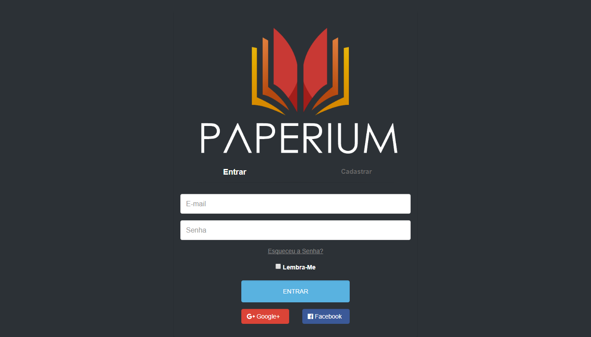

# Paperium

>Trabalho de Conclusão de Curso como objetivo de aumentar o  alcance da leitura proporcionado pela Biblioteca Publica de Mogi Mirim através de um sistema de web de leitura a acesso a informações de catalogo físico de Livros  

## Repositórios Usados
- [dog-ears Multi Auth][dog-ears]
- [cauoecs Laravel-lang][cauoecs]
- [jessengers Date https://github.com/jenssegers/date][jessengers]
- [intervention Image https://github.com/Intervention/image][intervention]

## Configurando o servidor
1. Clone oubaixe o repositório:
~~~bash
$! git clone https://github.com/sudeduardo/Paperium.git
~~~

2. Entre na pasta criada
~~~bash
$! cd Paperium
~~~

3. Execute o comando `composer install`
4. Crie um banco de dados no mysql
~~~sql
CREATE DATABASE Paperium;
~~~
5. Configure o `.env`
~~~php
DB_DATABASE=Paperium
DB_USERNAME=root
DB_PASSWORD=password
~~~

6. Execute `php artisan migrate` no seu terminal
7. Abra o servidor com o comando `php artisan serve`
8. Abra no navegador o link: `htttp://localhost:8000/`

[dog-ears]: https://github.com/dog-ears/laravel-multi-auth
[cauoecs]: https://github.com/caouecs/Laravel-lang
[jessengers]: https://github.com/jenssegers/date
[intervention]: https://github.com/Intervention/image
